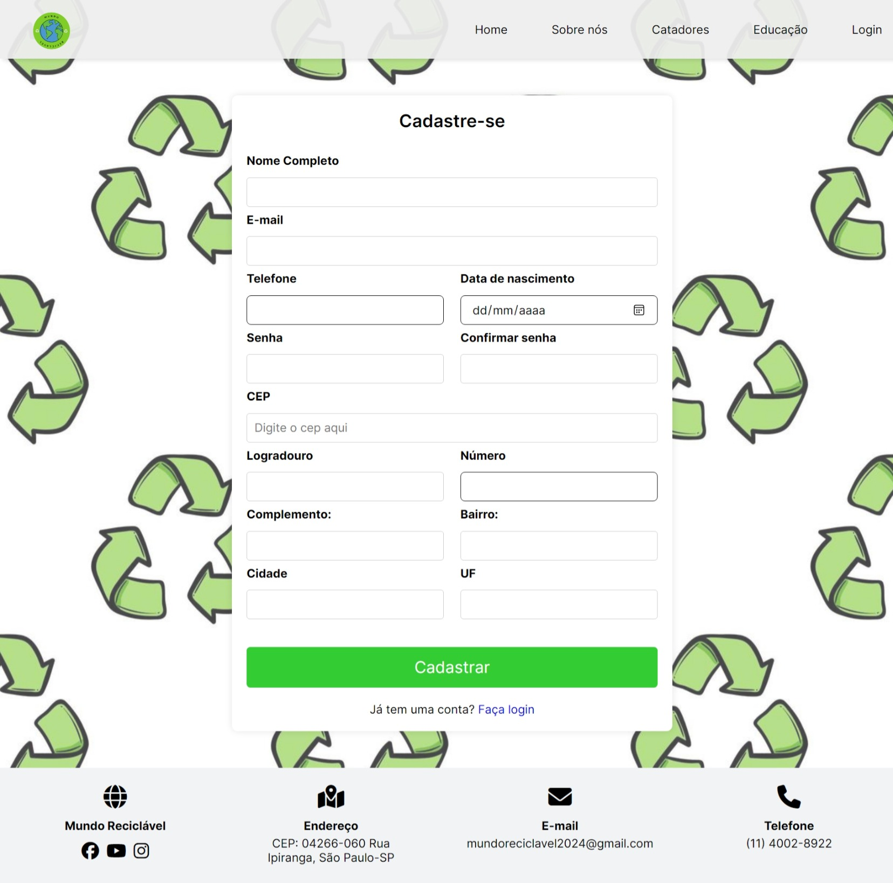
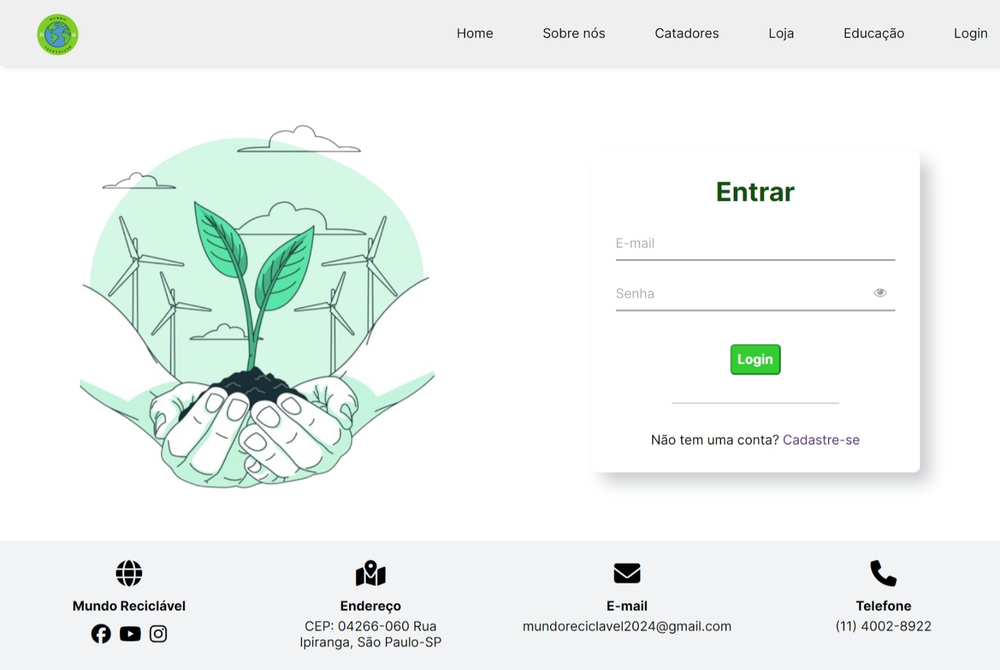
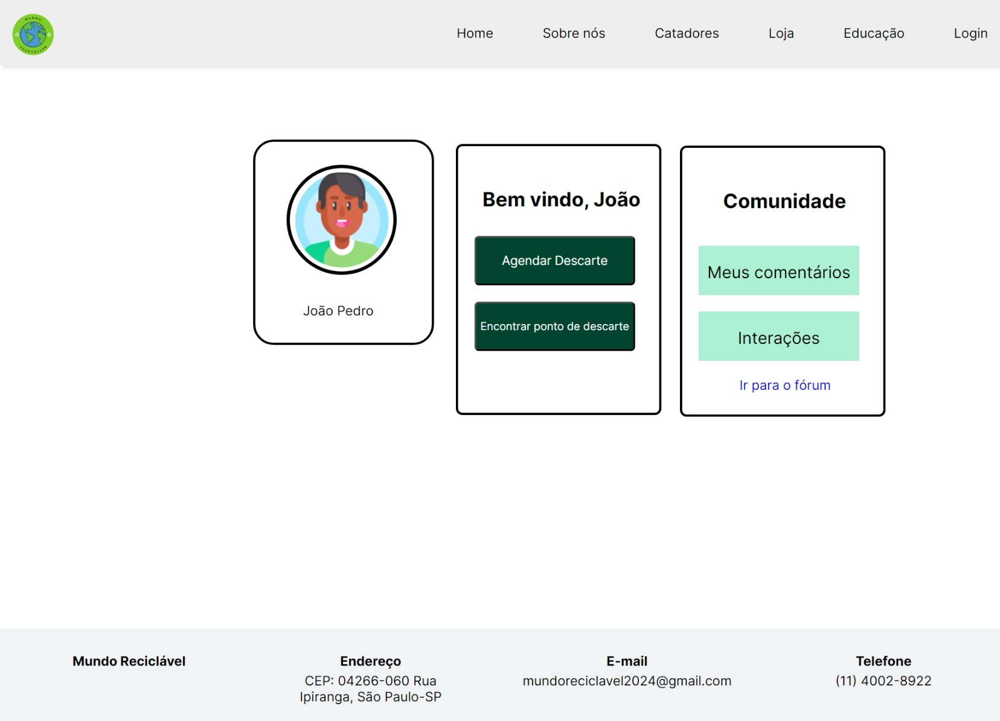
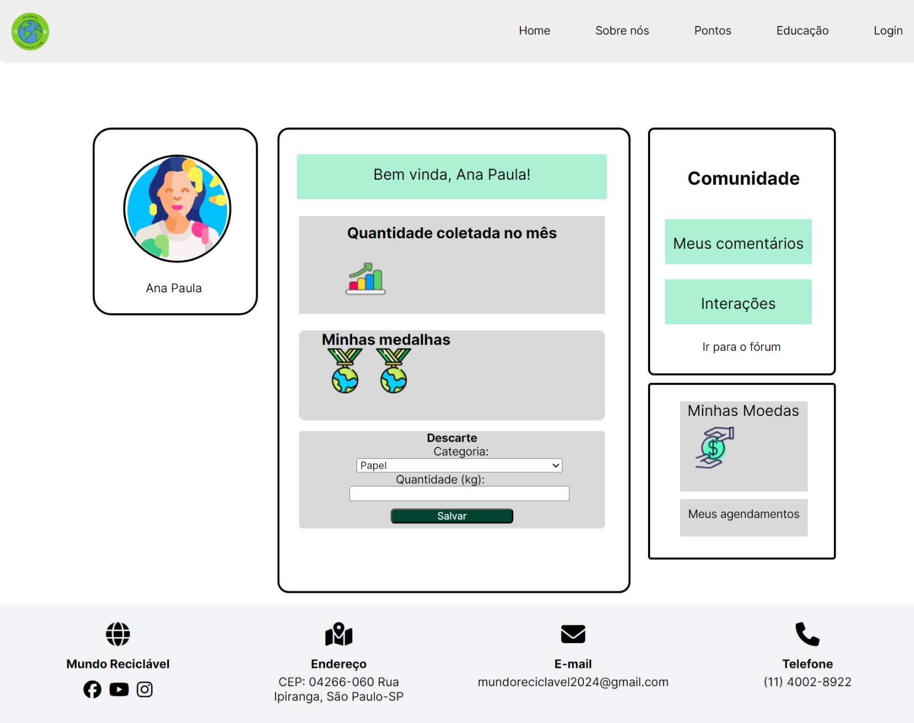
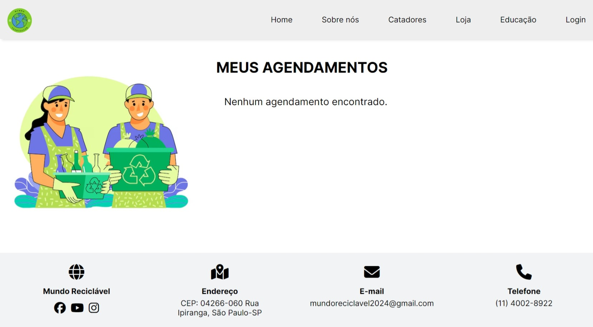
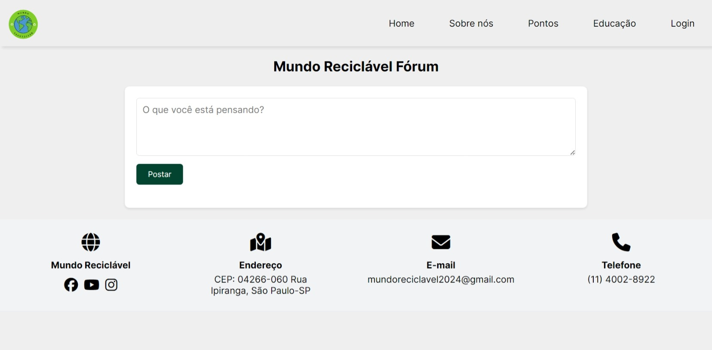
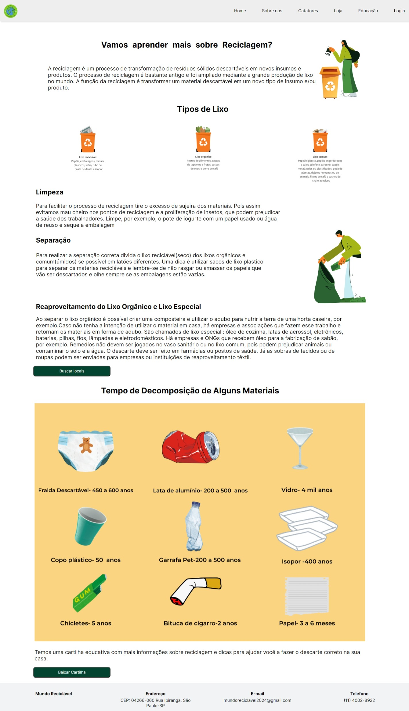
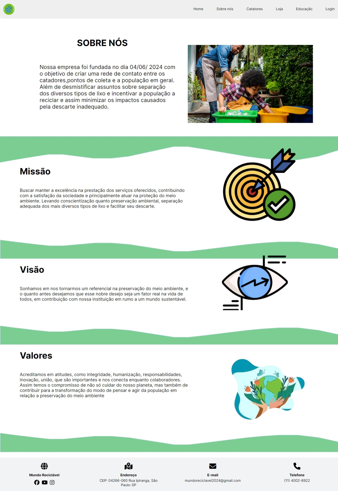

# Projeto final: Mundo reciclável 🌍♻️


Um site que ajuda realizar o descarte de lixo da maneira correta, conectando pontos de coleta, catadores e você. Contribuindo para a coleta seletiva, e tornando o processo de reciclagem mais fácil para encaixar no cotidiano, além de cooperar para a saúde do planeta.

## Índice

- <a href="#tecnologias-utilzadas-️">Tecnologias Utilizadas</a>

- <a href="#funcionalidades-do-projeto-">Funcionalidades do Projeto</a>

- <a href="#layout-do-projeto-">Layout do Projeto</a>

- <a href="#como-rodar-este-projeto">Como rodar esse projeto?</a>

- <a href="#pessoas-autoras">Pessoas Autoras</a>

## Tecnologias utilzadas ⚙️

 - **HTML**
 - **CSS**
 - **JavaScript**

 ## Funcionalidades do Projeto 📱

 - [x] Cadastro de usuários e catadores

 - [x] Login

 - [x] Busca de Pontos de Coleta e Catadores pelo CEP, seleção do tamanho do lixo e tipo de descarte.

 - [x] Agendamento de Coleta

 - [x] Fórum para Compartilhamento de Dicas.

 ## Layout do Projeto 📸

- Home do Projeto:


- Tela de Cadastro do Catador e Usuários:




- Tela de Login:



- Tela de Perfil do Usuário:



- Tela de Perfil do Catador:



- Tela da Busca pelos Pontos de Coleta e Catadores próximos:


- Tela de Agendamento de Coleta:



- Fórum para Compartilhamento de Dicas e Interações entre a comunidade da plataforma:




- Tela da página de Educação com dicas sobre a separação do lixo:





- Tela da página Sobre nós:




## Como rodar este projeto? 💿

[Veja o resultado clicando aqui.]()

`ou`

```bash

# Clone este repositório

$ git clone https://github.com/2024-1S-SENAI-SP-FE/Projeto-final-mundo-reciclavel.git

#Clique com o botão direito na pasta criada na Área de Trabalho e selecione abrir com VScode;

#Clique no botão GoLive para abrir o projeto;

 ```


## Pessoas Autoras ✏️


[CarlosLeandro](https://github.com/Carlos-Leandro-medeiros)


[JeniferScarlate](https://github.com/jeniferscarlate)

[JuarezLima](https://github.com/juarezLSantos)

[JulianaAlves](https://github.com/JulianaAMatos)
